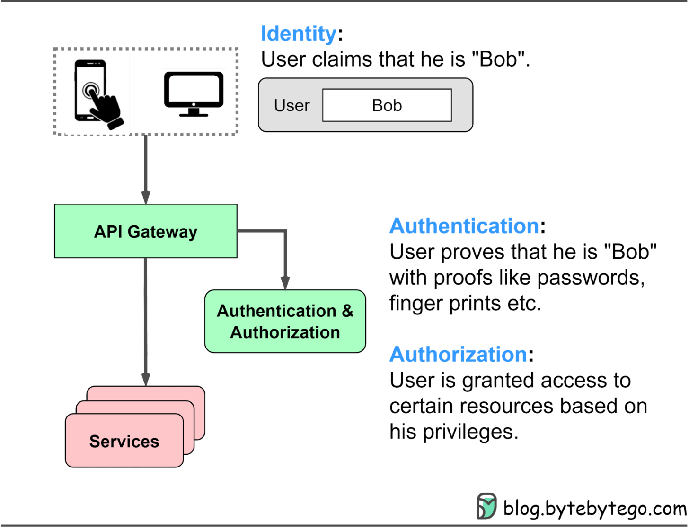
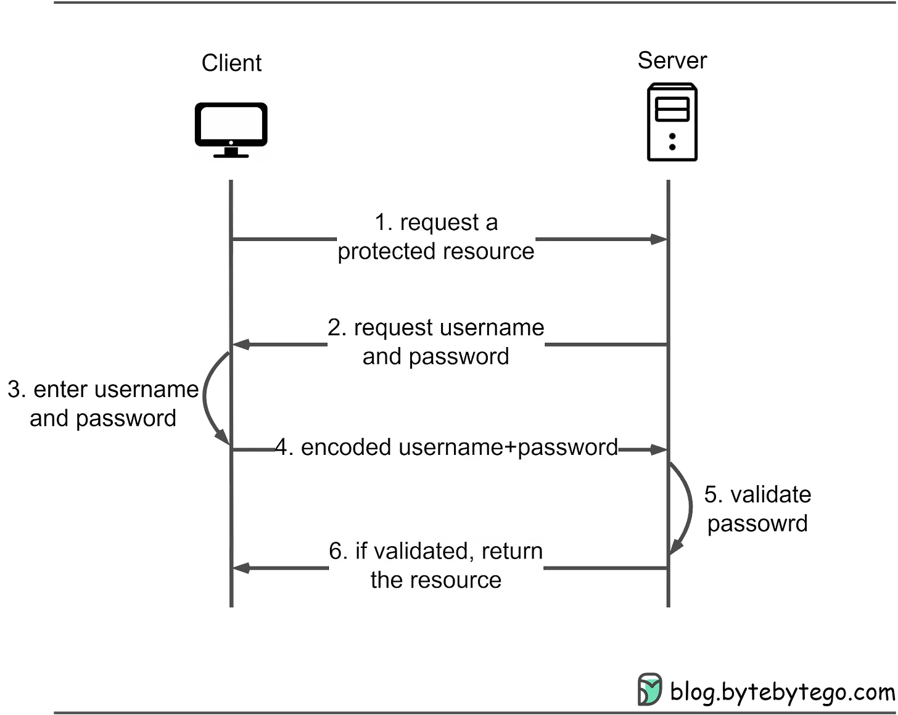
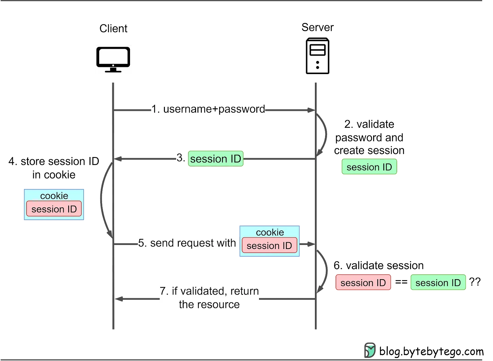

## Mật khẩu, Phiên, Cookie, Mã thông báo, JWT, SSO, OAuth - Giải thích về xác thực - Phần 1

Khi chúng tôi sử dụng các ứng dụng và trang web khác nhau, ba bước bảo mật thiết yếu liên tục được áp dụng:

- Danh tính
- Xác thực
- Ủy quyền

Sơ đồ bên dưới cho thấy nơi áp dụng các phương pháp này trong kiến ​​trúc trang web điển hình và ý nghĩa của chúng.

Trong loạt bài gồm 2 phần này, chúng tôi đi sâu vào các phương pháp xác thực khác nhau, bao gồm mật khẩu, phiên, cookie, mã thông báo, JWT (Mã thông báo web JSON), SSO (Đăng nhập một lần) và OAuth2. Chúng tôi thảo luận về các vấn đề mà mỗi phương pháp giải quyết và cách chọn phương thức xác thực phù hợp với nhu cầu của chúng tôi.

## Xác thực mật khẩu

Xác thực mật khẩu là cơ chế cơ bản và được sử dụng rộng rãi để xác minh danh tính người dùng trên các trang web và ứng dụng. Trong phương pháp này, người dùng nhập tổ hợp tên người dùng và mật khẩu duy nhất của họ để có quyền truy cập vào các tài nguyên được bảo vệ. Thông tin đăng nhập đã nhập sẽ được kiểm tra dựa trên thông tin người dùng được lưu trữ trong hệ thống và nếu chúng khớp nhau, người dùng sẽ được cấp quyền truy cập.

Mặc dù xác thực mật khẩu là phương pháp cơ bản để xác minh người dùng nhưng nó có một số hạn chế. Người dùng có thể quên mật khẩu của mình và việc quản lý tên người dùng cũng như mật khẩu duy nhất cho nhiều trang web có thể là một thách thức. Hơn nữa, các hệ thống dựa trên mật khẩu có thể dễ bị tấn công, chẳng hạn như tấn công vũ phu hoặc tấn công từ điển, nếu không áp dụng các biện pháp bảo mật thích hợp.

Để giải quyết những vấn đề này, các hệ thống hiện đại thường triển khai các biện pháp bảo mật bổ sung, chẳng hạn như xác thực đa yếu tố hoặc sử dụng các cơ chế xác thực khác (ví dụ: xác thực dựa trên cookie phiên hoặc dựa trên mã thông báo) để bổ sung hoặc thay thế xác thực dựa trên mật khẩu để truy cập tiếp theo vào các tài khoản được bảo vệ. tài nguyên.

Trong phần này, trước tiên chúng tôi sẽ đề cập đến xác thực dựa trên mật khẩu để hiểu lịch sử của nó và cách thức hoạt động của nó.

## Xác thực truy cập cơ bản HTTP

Xác thực truy cập cơ bản HTTP yêu cầu trình duyệt web cung cấp tên người dùng và mật khẩu khi yêu cầu tài nguyên được bảo vệ. Thông tin xác thực được mã hóa bằng thuật toán Base64 và được bao gồm trong trường tiêu đề HTTP <em>Ủy quyền</em> : Cơ bản.

Đây là cách nó thường hoạt động:

<ol>
<li>Máy khách gửi yêu cầu truy cập tài nguyên được bảo vệ trên máy chủ.</li>
<li>Nếu máy khách chưa cung cấp bất kỳ thông tin xác thực nào, máy chủ sẽ phản hồi bằng mã trạng thái Không được phép 401 và bao gồm tiêu đề WWW-Authenticate: Basic để cho biết rằng nó yêu cầu xác thực cơ bản.</li>
<li>Sau đó, khách hàng sẽ nhắc người dùng nhập tên người dùng và mật khẩu của họ, được kết hợp thành một chuỗi duy nhất ở định dạng tên người dùng: mật khẩu.</li>
<li>Chuỗi kết hợp được mã hóa Base64 và được bao gồm trong tiêu đề "Ủy quyền: Cơ bản" trong yêu cầu tiếp theo tới máy chủ, ví dụ: Ủy quyền: Basic dXNlcm5hbWU6cGFzc3dvcmQ=.</li>
<li>Khi nhận được yêu cầu, máy chủ sẽ giải mã thông tin xác thực được mã hóa Base64 và phân tách tên người dùng và mật khẩu. Sau đó, máy chủ sẽ kiểm tra thông tin xác thực được cung cấp dựa trên cơ sở dữ liệu người dùng hoặc dịch vụ xác thực của nó.</li>
<li>Nếu thông tin đăng nhập khớp nhau, máy chủ sẽ cấp quyền truy cập vào tài nguyên được yêu cầu. Nếu không, máy chủ sẽ phản hồi bằng mã trạng thái Không được phép 401.</li>
</ol>
Xác thực truy cập cơ bản HTTP có những hạn chế. Tên người dùng và mật khẩu, được mã hóa bằng Base64, có thể được giải mã dễ dàng. Hầu hết các trang web đều sử dụng TLS (Transport Layer Security) để mã hóa dữ liệu giữa trình duyệt và máy chủ, nâng cao tính bảo mật. Tuy nhiên, thông tin đăng nhập của người dùng vẫn có thể bị chặn hoặc bị tấn công bởi kẻ trung gian.

Với Xác thực truy cập cơ bản HTTP, trình duyệt sẽ gửi tiêu đề Cấp phép cùng với thông tin xác thực cần thiết cho mỗi yêu cầu tới các tài nguyên được bảo vệ trong cùng một miền. Điều này mang lại trải nghiệm người dùng mượt mà hơn mà không cần phải nhập lại tên người dùng và mật khẩu. Tuy nhiên, vì mỗi trang web duy trì tên người dùng và mật khẩu riêng nên người dùng có thể khó nhớ thông tin đăng nhập của họ.

Cơ chế xác thực này đã lỗi thời đối với các trang web hiện đại.

## Xác thực cookie phiên

Xác thực cookie phiên giải quyết việc xác thực truy cập cơ bản HTTP không thể theo dõi trạng thái đăng nhập của người dùng. ID phiên được tạo để theo dõi trạng thái của người dùng trong lần truy cập của họ. ID phiên này được ghi lại cả phía máy chủ và trong cookie của máy khách, đóng vai trò như một cơ chế xác thực. Nó được gọi là cookie phiên vì nó là cookie có ID phiên được lưu trữ bên trong. Ban đầu, người dùng vẫn phải cung cấp tên người dùng và mật khẩu, sau đó máy chủ sẽ tạo phiên cho lượt truy cập của người dùng. Các yêu cầu tiếp theo bao gồm cookie, cho phép máy chủ so sánh ID phiên phía máy khách và phía máy chủ.

Hãy xem nó hoạt động như thế nào:

<ol>
<li>Máy khách gửi yêu cầu truy cập tài nguyên được bảo vệ trên máy chủ. Nếu máy khách chưa được xác thực, máy chủ sẽ phản hồi bằng lời nhắc đăng nhập. Khách hàng gửi tên người dùng và mật khẩu của họ đến máy chủ.</li>
<li>Máy chủ xác minh thông tin xác thực được cung cấp dựa trên cơ sở dữ liệu người dùng hoặc dịch vụ xác thực. Nếu thông tin đăng nhập khớp nhau, máy chủ sẽ tạo một ID phiên duy nhất và tạo phiên tương ứng trong bộ lưu trữ phía máy chủ (ví dụ: bộ nhớ máy chủ, cơ sở dữ liệu hoặc máy chủ phiên).</li>
<li>Máy chủ gửi ID phiên tới máy khách dưới dạng cookie, thường có tiêu đề Set-Cookie.</li>
<li>Máy khách lưu trữ cookie phiên.</li>
<li>Đối với các yêu cầu tiếp theo, nó sẽ gửi cookie cùng với tiêu đề yêu cầu.</li>
<li>Máy chủ kiểm tra ID phiên trong cookie dựa trên dữ liệu phiên được lưu trữ để xác thực người dùng.</li>
<li>Nếu được xác thực, máy chủ sẽ cấp quyền truy cập vào tài nguyên được yêu cầu. Khi người dùng đăng xuất hoặc sau thời gian hết hạn được xác định trước, máy chủ sẽ vô hiệu hóa phiên và khách hàng sẽ xóa cookie phiên.</li>
</ol>

link bìa dịch: https://blog.bytebytego.com/p/password-session-cookie-token-jwt?utm_source=%2Fsearch%2FPassword%252C%2520Session%252C%2520Cookie%252C%2520Token%252C%2520JWT%252C%2520SSO%252C%2520OAuth%2520-%2520Authentication%2520Explained%2520&utm_medium=reader2